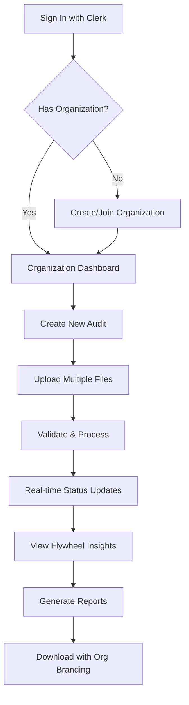

# Amazon Advertising Audit Tool - Front-End Architecture

## 1. Overview

### Design Principles
- **Progressive Disclosure**: Guide users through complex audit process step-by-step
- **Data-Heavy Optimization**: Handle large datasets and visualizations efficiently
- **Agency-Professional**: Clean, trustworthy interface suitable for client presentations
- **Multi-Tenant First**: Organization-based data isolation from the ground up

### Technology Stack
```
Next.js 14 + TypeScript
├── App Router (RSC support)
├── Tailwind CSS + shadcn/ui (UI Components)
├── Recharts (Data visualization)
├── Zustand (Client state)
├── TanStack Query (Server state)
├── React Hook Form + Zod (Form handling)
├── Clerk (Auth + Organizations)
└── Supabase JS (Storage + Realtime)
```

## 2. Application Structure (Next.js App Router)

```
app/
├── (auth)/                    # Auth pages (public)
│   ├── sign-in/[[...rest]]/
│   └── sign-up/[[...rest]]/
├── (dashboard)/               # Protected org-scoped routes
│   ├── layout.tsx            # Org switcher + nav
│   ├── [orgId]/
│   │   ├── audits/
│   │   │   ├── page.tsx      # Audit list
│   │   │   └── [auditId]/    # Audit details
│   │   ├── insights/         # Flywheel insights
│   │   └── settings/         # Org settings
│   └── onboarding/           # First-time setup
├── api/                      # API routes
│   ├── audits/
│   └── webhooks/
│       └── clerk/            # Clerk webhooks
components/                    # Shared components
├── ui/                       # shadcn/ui components
├── audits/                   # Audit-specific
├── charts/                   # Data visualizations
└── layouts/                  # Layout components
lib/                          # Core utilities
├── api/                      # API client
├── supabase/                # Supabase client
├── clerk/                   # Clerk config
└── utils/                   # Helpers
```

## 3. Core Features Implementation

### 3.1 Multi-Tenant File Upload

```typescript
// Direct to Supabase with org isolation
interface UploadState {
  files: {
    campaign?: File
    keyword?: File
    searchTerm?: File
    product?: File
    portfolio?: File
  }
  validation: Record<string, ValidationResult>
  uploadProgress: Record<string, number>
}

const useFileUpload = () => {
  const { organization } = useOrganization()
  const supabase = useSupabase()
  
  const uploadFile = async (file: File, type: FileType, auditId: string) => {
    // Org-scoped path
    const path = `${organization?.id}/${auditId}/${type}/${file.name}`
    
    // Direct upload to Supabase
    const { data, error } = await supabase.storage
      .from('audits')
      .upload(path, file, {
        cacheControl: '3600',
        upsert: false
      })
    
    // Real-time progress via Supabase
    return data
  }
  
  const uploadMultiple = async (files: UploadState['files'], auditId: string) => {
    const uploads = Object.entries(files).map(([type, file]) => 
      file ? uploadFile(file, type as FileType, auditId) : null
    )
    
    return Promise.all(uploads.filter(Boolean))
  }
}
```

### 3.2 Real-time Analysis Status

```typescript
// Server Component with live updates
export default async function AuditStatus({ 
  params 
}: { 
  params: { orgId: string; auditId: string } 
}) {
  const { orgId, auditId } = params
  
  // Server-side data fetch
  const audit = await getAudit(orgId, auditId)
  
  return (
    <div className="space-y-6">
      {/* Client component for real-time updates */}
      <AuditProgress auditId={auditId} />
      <AuditMetrics data={audit.metrics} />
      <FlywheelInsights data={audit.flywheel} />
    </div>
  )
}

// Client component with Supabase realtime
'use client'

function AuditProgress({ auditId }: { auditId: string }) {
  const [status, setStatus] = useState<AuditStatus>()
  
  useEffect(() => {
    // Subscribe to audit status changes
    const channel = supabase
      .channel(`audit:${auditId}`)
      .on('postgres_changes', {
        event: 'UPDATE',
        schema: 'public',
        table: 'audits',
        filter: `id=eq.${auditId}`
      }, (payload) => {
        setStatus(payload.new)
      })
      .subscribe()
      
    return () => { supabase.removeChannel(channel) }
  }, [auditId])
  
  return <ProgressDisplay status={status} />
}
```

### 3.3 Flywheel Insights Visualization

```tsx
// Flywheel analysis with shadcn/ui + Recharts
interface FlywheelInsight {
  asin: string
  keyword: string
  currentAdRevenue: number
  totalRevenue: number
  adAttributionPercent: number
  trend: 'improving' | 'stable' | 'declining'
  recommendedAction: string
  potentialSavings: number
}

export function FlywheelChart({ insights }: { insights: FlywheelInsight[] }) {
  const chartData = insights.map(insight => ({
    name: insight.keyword,
    attribution: insight.adAttributionPercent,
    savings: insight.potentialSavings,
    trend: insight.trend
  }))
  
  return (
    <Card>
      <CardHeader>
        <CardTitle>Paid-Organic Flywheel Opportunities</CardTitle>
        <CardDescription>
          Keywords transitioning from paid to organic dominance
        </CardDescription>
      </CardHeader>
      <CardContent>
        <ResponsiveContainer width="100%" height={400}>
          <LineChart data={chartData}>
            <CartesianGrid strokeDasharray="3 3" />
            <XAxis dataKey="name" />
            <YAxis yAxisId="left" label="Attribution %" />
            <YAxis yAxisId="right" orientation="right" label="Savings $" />
            <Tooltip content={<CustomTooltip />} />
            <Line 
              yAxisId="left" 
              dataKey="attribution" 
              stroke="#8b5cf6" 
              strokeWidth={2}
            />
            <Line 
              yAxisId="right" 
              dataKey="savings" 
              stroke="#10b981" 
              strokeWidth={2}
            />
          </LineChart>
        </ResponsiveContainer>
      </CardContent>
    </Card>
  )
}
```

### 3.4 Multi-Tenant Report Generation

```typescript
// Organization-aware exports
interface ExportConfig {
  format: 'pdf' | 'excel' | 'csv'
  sections: {
    executiveSummary: boolean
    performanceMetrics: boolean
    flywheelAnalysis: boolean
    seasonalityInsights: boolean
    competitorGaps: boolean
    recommendations: boolean
  }
  branding: OrganizationBranding
}

const useReportGeneration = () => {
  const { organization } = useOrganization()
  const [generating, setGenerating] = useState(false)
  
  const generateReport = async (auditId: string, config: ExportConfig) => {
    setGenerating(true)
    
    try {
      // Call Railway API with org context
      const response = await fetch('/api/reports/generate', {
        method: 'POST',
        headers: {
          'Authorization': `Bearer ${await getToken()}`,
          'X-Organization-ID': organization?.id
        },
        body: JSON.stringify({ auditId, config })
      })
      
      const { downloadUrl } = await response.json()
      
      // Download from Supabase
      const { data } = await supabase.storage
        .from('reports')
        .download(downloadUrl)
        
      // Trigger browser download
      downloadBlob(data, `audit-${auditId}.${config.format}`)
    } finally {
      setGenerating(false)
    }
  }
  
  return { generateReport, generating }
}
```

## 4. State Management Architecture

### 4.1 Client State (Zustand)

```typescript
// Minimal client state for UI
interface UIStore {
  sidebarCollapsed: boolean
  uploadProgress: Record<string, number>
  activeFilters: FilterState
  toggleSidebar: () => void
  setUploadProgress: (fileId: string, progress: number) => void
  updateFilters: (filters: Partial<FilterState>) => void
}

// Organization context from Clerk
export function useOrgContext() {
  const { organization, isLoaded } = useOrganization()
  const { user } = useUser()
  
  return {
    orgId: organization?.id,
    orgName: organization?.name,
    userRole: organization?.publicUserData?.role,
    isAdmin: organization?.publicUserData?.role === 'admin'
  }
}

// Audit data via TanStack Query
export function useAudits() {
  const { orgId } = useOrgContext()
  
  return useQuery({
    queryKey: ['audits', orgId],
    queryFn: () => fetchAudits(orgId),
    enabled: !!orgId
  })
}
```

### 4.2 Server State (TanStack Query + Server Components)

```tsx
// Server Component data fetching
export default async function AuditsPage({ 
  params 
}: { 
  params: { orgId: string } 
}) {
  // Server-side fetch with auth
  const audits = await fetchAuditsServer(params.orgId)
  
  return (
    <div>
      <AuditsList initialData={audits} />
    </div>
  )
}

// Client Component with mutations
'use client'

export function AuditsList({ initialData }: { initialData: Audit[] }) {
  const { orgId } = useOrgContext()
  
  // Hydrate from server data
  const { data: audits } = useQuery({
    queryKey: ['audits', orgId],
    queryFn: () => fetchAudits(orgId),
    initialData,
    refetchInterval: 30000 // Poll for updates
  })
  
  const createAudit = useMutation({
    mutationFn: (files: FileList) => {
      return createNewAudit(orgId, files)
    },
    onSuccess: () => {
      queryClient.invalidateQueries(['audits', orgId])
      toast.success('Audit created successfully')
    }
  })
  
  return <AuditTable audits={audits} onCreate={createAudit.mutate} />
}
```

## 5. Component Library (shadcn/ui + Tailwind)

### 5.1 Design System

```typescript
// tailwind.config.ts
export default {
  theme: {
    extend: {
      colors: {
        // Custom brand colors
        flywheel: {
          50: '#faf5ff',
          500: '#8b5cf6',
          600: '#7c3aed',
          700: '#6d28d9',
        },
        // Semantic colors via CSS variables
        background: 'hsl(var(--background))',
        foreground: 'hsl(var(--foreground))',
        primary: {
          DEFAULT: 'hsl(var(--primary))',
          foreground: 'hsl(var(--primary-foreground))'
        },
        // Agency-specific theming
        agency: {
          primary: 'var(--agency-primary)',
          secondary: 'var(--agency-secondary)'
        }
      }
    }
  }
}

// Organization theme provider
export function ThemeProvider({ children }: { children: React.ReactNode }) {
  const { organization } = useOrganization()
  
  // Apply org-specific CSS variables
  useEffect(() => {
    if (organization?.publicMetadata?.theme) {
      const theme = organization.publicMetadata.theme as OrgTheme
      document.documentElement.style.setProperty('--agency-primary', theme.primary)
      document.documentElement.style.setProperty('--agency-secondary', theme.secondary)
    }
  }, [organization])
  
  return <>{children}</>
}
```

### 5.2 Key Components

```tsx
// Multi-file upload with shadcn/ui
export function FileUploadZone({ onUpload }: { onUpload: (files: FileMap) => void }) {
  const [files, setFiles] = useState<FileMap>({})
  const { getRootProps, getInputProps } = useDropzone({
    accept: {
      'text/csv': ['.csv'],
      'application/vnd.ms-excel': ['.xls', '.xlsx']
    },
    maxSize: 500 * 1024 * 1024,
    onDrop: (acceptedFiles) => {
      // Auto-detect file types
      const categorized = categorizeFiles(acceptedFiles)
      setFiles(categorized)
    }
  })
  
  return (
    <Card className="border-dashed">
      <CardContent {...getRootProps()} className="p-12 text-center">
        <input {...getInputProps()} />
        <Upload className="mx-auto h-12 w-12 text-muted-foreground" />
        <p className="mt-4 text-sm text-muted-foreground">
          Drop your Amazon Advertising export files here
        </p>
        <Badge variant="secondary" className="mt-2">
          Campaign, Keyword, Search Term, Product reports
        </Badge>
      </CardContent>
    </Card>
  )
}

// Flywheel insight card
export function FlywheelInsightCard({ insight }: { insight: FlywheelInsight }) {
  const savings = formatCurrency(insight.potentialSavings)
  
  return (
    <Card className={cn(
      "border-l-4",
      insight.trend === 'improving' && "border-l-green-500",
      insight.trend === 'stable' && "border-l-yellow-500",
      insight.trend === 'declining' && "border-l-red-500"
    )}>
      <CardHeader>
        <div className="flex items-center justify-between">
          <CardTitle className="text-lg">{insight.keyword}</CardTitle>
          <Badge variant={insight.trend === 'improving' ? 'success' : 'secondary'}>
            {insight.adAttributionPercent}% Ad-Attributed
          </Badge>
        </div>
      </CardHeader>
      <CardContent>
        <p className="text-sm text-muted-foreground mb-4">
          {insight.recommendedAction}
        </p>
        <div className="flex items-center gap-4">
          <div className="flex items-center gap-1">
            <TrendingDown className="h-4 w-4 text-green-500" />
            <span className="text-sm font-medium">{savings}/mo savings</span>
          </div>
          <div className="flex items-center gap-1">
            <Target className="h-4 w-4 text-blue-500" />
            <span className="text-sm">{insight.asin}</span>
          </div>
        </div>
      </CardContent>
    </Card>
  )
}
```

## 6. Performance Optimizations

### 6.1 Next.js App Router Optimizations

```typescript
// Streaming with Suspense boundaries
export default async function AuditsPage() {
  return (
    <div>
      <Suspense fallback={<AuditListSkeleton />}>
        <AuditList />
      </Suspense>
      <Suspense fallback={<MetricsSkeleton />}>
        <AuditMetrics />
      </Suspense>
    </div>
  )
}

// Parallel data fetching
async function AuditDetails({ auditId }: { auditId: string }) {
  // Parallel fetch for better performance
  const [audit, insights, recommendations] = await Promise.all([
    getAudit(auditId),
    getFlywheelInsights(auditId),
    getRecommendations(auditId)
  ])
  
  return <AuditView data={{ audit, insights, recommendations }} />
}
```

### 6.2 Large Data Handling

```typescript
// Virtual scrolling for recommendation lists
import { useVirtualizer } from '@tanstack/react-virtual'

export function RecommendationList({ items }: { items: Recommendation[] }) {
  const parentRef = useRef<HTMLDivElement>(null)
  
  const virtualizer = useVirtualizer({
    count: items.length,
    getScrollElement: () => parentRef.current,
    estimateSize: () => 120,
    overscan: 5
  })
  
  return (
    <div ref={parentRef} className="h-[600px] overflow-auto">
      <div
        style={{
          height: `${virtualizer.getTotalSize()}px`,
          position: 'relative',
        }}
      >
        {virtualizer.getVirtualItems().map((virtualItem) => (
          <RecommendationCard
            key={virtualItem.key}
            item={items[virtualItem.index]}
            style={{
              position: 'absolute',
              top: 0,
              left: 0,
              width: '100%',
              transform: `translateY(${virtualItem.start}px)`,
            }}
          />
        ))}
      </div>
    </div>
  )
}
```

### 6.3 Chart Performance

```typescript
// Optimized chart rendering with React.memo
const FlywheelChart = memo(({ data }: { data: FlywheelData[] }) => {
  // Memoize processed data
  const chartData = useMemo(() => 
    data.map(d => ({
      name: d.keyword,
      attribution: d.adAttributionPercent,
      savings: d.potentialSavings
    })),
    [data]
  )
  
  return (
    <ResponsiveContainer width="100%" height={400}>
      <LineChart data={chartData}>
        <Line 
          type="monotone" 
          dataKey="attribution"
          dot={false} // Disable dots for performance
          strokeWidth={2}
        />
      </LineChart>
    </ResponsiveContainer>
  )
}, (prevProps, nextProps) => {
  // Custom comparison for re-render optimization
  return JSON.stringify(prevProps.data) === JSON.stringify(nextProps.data)
})
```

### 6.4 Supabase Query Optimization

```typescript
// Efficient data fetching with select and filters
export async function getAuditsForOrg(orgId: string) {
  const { data, error } = await supabase
    .from('audits')
    .select(`
      id,
      created_at,
      status,
      metrics:audit_metrics(acos, roas, total_spend),
      flywheel_count:flywheel_insights(count)
    `)
    .eq('organization_id', orgId)
    .order('created_at', { ascending: false })
    .limit(20)
  
  return data
}

// Real-time subscription with filters
const channel = supabase
  .channel('org-audits')
  .on('postgres_changes', {
    event: '*',
    schema: 'public',
    table: 'audits',
    filter: `organization_id=eq.${orgId}`
  }, handleAuditChange)
  .subscribe()
```

## 7. User Flows

### 7.1 Organization-Aware Audit Flow



### Key User Paths:

1. **First-Time Agency Setup**
   - Sign up → Create organization → Invite team → Configure branding
   
2. **Regular Audit Creation**
   - Select org → Upload files → Monitor progress → Review insights
   
3. **Multi-Client Management**
   - Switch organizations → View all audits → Compare performance

### 7.2 Error Handling & Edge Cases

```tsx
// Next.js error boundary
'use client'

export default function Error({
  error,
  reset,
}: {
  error: Error & { digest?: string }
  reset: () => void
}) {
  useEffect(() => {
    // Log to error tracking (e.g., Sentry)
    captureException(error)
  }, [error])
  
  return (
    <div className="flex min-h-[400px] flex-col items-center justify-center">
      <AlertCircle className="h-12 w-12 text-destructive" />
      <h2 className="mt-4 text-lg font-semibold">
        {getErrorMessage(error)}
      </h2>
      <Button onClick={reset} className="mt-4">
        Try again
      </Button>
    </div>
  )
}

// Organization-aware error handling
export function getErrorMessage(error: Error): string {
  if (error.message.includes('ORG_SUSPENDED')) {
    return 'Your organization has been suspended. Please contact support.'
  }
  if (error.message.includes('QUOTA_EXCEEDED')) {
    return 'You\'ve reached your monthly audit limit. Please upgrade your plan.'
  }
  if (error.message.includes('FILE_TOO_LARGE')) {
    return 'One or more files exceed the 500MB limit.'
  }
  return 'Something went wrong. Please try again.'
}

// Clerk auth error handling
export function AuthError() {
  return (
    <SignIn 
      appearance={{
        elements: {
          rootBox: "mx-auto",
          card: "shadow-xl"
        }
      }}
      afterSignInUrl="/dashboard"
    />
  )
}
```

## 8. Responsive Design

### 8.1 Tailwind Breakpoints

```typescript
// Responsive utilities with Tailwind
export function AuditUpload() {
  return (
    <div className="w-full">
      {/* Mobile warning */}
      <Alert className="mb-4 lg:hidden">
        <AlertCircle className="h-4 w-4" />
        <AlertDescription>
          For the best experience, please use a desktop computer to upload and analyze audits.
        </AlertDescription>
      </Alert>
      
      {/* Desktop upload interface */}
      <div className="hidden lg:block">
        <FileUploadZone />
      </div>
      
      {/* Mobile view-only interface */}
      <div className="block lg:hidden">
        <AuditListMobile />
      </div>
    </div>
  )
}

// Responsive grid layouts
export function MetricsGrid({ metrics }: { metrics: Metric[] }) {
  return (
    <div className="grid grid-cols-1 md:grid-cols-2 xl:grid-cols-4 gap-4">
      {metrics.map(metric => (
        <MetricCard key={metric.id} {...metric} />
      ))}
    </div>
  )
}
```

### 8.2 Mobile Considerations

```typescript
// Touch-optimized interactions
const MobileRecommendationCard = ({ item }: { item: Recommendation }) => {
  const [expanded, setExpanded] = useState(false)
  
  return (
    <Card 
      className="mb-4 cursor-pointer"
      onClick={() => setExpanded(!expanded)}
    >
      <CardHeader className="pb-3">
        <div className="flex items-center justify-between">
          <CardTitle className="text-base">{item.title}</CardTitle>
          <ChevronDown 
            className={cn(
              "h-4 w-4 transition-transform",
              expanded && "rotate-180"
            )}
          />
        </div>
      </CardHeader>
      {expanded && (
        <CardContent>
          <p className="text-sm text-muted-foreground">
            {item.description}
          </p>
          <div className="mt-3 flex items-center gap-2">
            <Badge variant="outline" className="text-xs">
              {item.impact}
            </Badge>
            <Badge variant="secondary" className="text-xs">
              {item.effort}
            </Badge>
          </div>
        </CardContent>
      )}
    </Card>
  )
}
```

## 9. Accessibility

### 9.1 WCAG 2.1 AA Compliance

```typescript
// Keyboard navigation
const FileUpload = () => {
  return (
    <div
      role="button"
      tabIndex={0}
      onKeyPress={handleKeyPress}
      aria-label="Upload Amazon Advertising files"
    >
      {/* Dropzone content */}
    </div>
  )
}

// Screen reader announcements
const ProgressAnnouncer = ({ progress }) => {
  return (
    <div className="sr-only" aria-live="polite">
      Analysis {progress}% complete
    </div>
  )
}
```

## 10. Security Considerations

### 10.1 Frontend Security with Clerk & Supabase

```typescript
// Clerk session validation
import { auth } from '@clerk/nextjs'

export async function secureServerAction() {
  const { userId, sessionClaims } = auth()
  
  if (!userId) {
    throw new Error('Unauthorized')
  }
  
  // Validate organization access
  const orgId = sessionClaims?.org_id
  if (!orgId) {
    throw new Error('No organization selected')
  }
  
  // Proceed with org-scoped action
  return performAction(userId, orgId)
}

// Supabase RLS policies
export async function setupSupabaseClient() {
  const session = await getSession()
  
  const supabase = createClientComponentClient({
    supabaseUrl: process.env.NEXT_PUBLIC_SUPABASE_URL!,
    supabaseKey: process.env.NEXT_PUBLIC_SUPABASE_ANON_KEY!,
    options: {
      global: {
        headers: {
          'x-org-id': session?.orgId || '',
        },
      },
    },
  })
  
  return supabase
}

// File upload validation
const validateUpload = (file: File) => {
  const MAX_SIZE = 500 * 1024 * 1024 // 500MB
  const ALLOWED_TYPES = ['text/csv', 'application/vnd.ms-excel']
  
  if (file.size > MAX_SIZE) {
    throw new Error('File too large')
  }
  
  if (!ALLOWED_TYPES.includes(file.type)) {
    throw new Error('Invalid file type')
  }
  
  // Additional validation for file content
  return validateFileStructure(file)
}
```

### 10.2 Content Security Policy

```typescript
// next.config.js security headers
const securityHeaders = [
  {
    key: 'Content-Security-Policy',
    value: `
      default-src 'self';
      script-src 'self' 'unsafe-eval' 'unsafe-inline' *.clerk.com;
      style-src 'self' 'unsafe-inline';
      img-src 'self' data: https: *.clerk.com;
      font-src 'self';
      connect-src 'self' *.supabase.co *.clerk.com wss://*.supabase.co;
      frame-src 'self' *.clerk.com;
    `.replace(/\n/g, ' ').trim()
  },
  {
    key: 'X-Frame-Options',
    value: 'DENY'
  },
  {
    key: 'X-Content-Type-Options',
    value: 'nosniff'
  },
  {
    key: 'Referrer-Policy',
    value: 'strict-origin-when-cross-origin'
  }
]
```

## 11. Component Development with Storybook

### 11.1 Storybook Setup

```typescript
// .storybook/main.ts
import type { StorybookConfig } from '@storybook/nextjs'

const config: StorybookConfig = {
  stories: ['../components/**/*.stories.@(js|jsx|ts|tsx|mdx)'],
  addons: [
    '@storybook/addon-essentials',
    '@storybook/addon-interactions',
    '@storybook/addon-a11y',
    '@storybook/addon-links',
    '@chromatic-com/storybook',
  ],
  framework: {
    name: '@storybook/nextjs',
    options: {},
  },
}

export default config
```

### 11.2 Component Stories

```typescript
// components/audits/FlywheelChart.stories.tsx
import type { Meta, StoryObj } from '@storybook/react'
import { FlywheelChart } from './FlywheelChart'

const meta: Meta<typeof FlywheelChart> = {
  title: 'Audits/FlywheelChart',
  component: FlywheelChart,
  parameters: {
    layout: 'centered',
  },
  tags: ['autodocs'],
  argTypes: {
    insights: {
      description: 'Flywheel opportunity data',
    },
  },
}

export default meta
type Story = StoryObj<typeof meta>

export const Default: Story = {
  args: {
    insights: [
      {
        asin: 'B08XYZ123',
        keyword: 'wireless headphones',
        adAttributionPercent: 85,
        trend: 'improving',
        potentialSavings: 450.00,
      },
      {
        asin: 'B08ABC456',
        keyword: 'bluetooth earbuds',
        adAttributionPercent: 65,
        trend: 'stable',
        potentialSavings: 230.00,
      },
    ],
  },
}

export const NoOpportunities: Story = {
  args: {
    insights: [],
  },
}

export const MobileView: Story = {
  parameters: {
    viewport: {
      defaultViewport: 'mobile1',
    },
  },
  args: Default.args,
}
```

## 12. Testing Strategy

### 12.1 Component Testing

```typescript
// Vitest + React Testing Library for Next.js
import { render, screen, waitFor } from '@testing-library/react'
import { ClerkProvider } from '@clerk/nextjs'
import { QueryClient, QueryClientProvider } from '@tanstack/react-query'
import { vi } from 'vitest'

// Mock providers wrapper
const AllProviders = ({ children }: { children: React.ReactNode }) => {
  const queryClient = new QueryClient({
    defaultOptions: { queries: { retry: false } }
  })
  
  return (
    <ClerkProvider>
      <QueryClientProvider client={queryClient}>
        {children}
      </QueryClientProvider>
    </ClerkProvider>
  )
}

describe('FlywheelChart', () => {
  it('shows improving organic trend', async () => {
    const mockData = [
      { keyword: 'test', adAttributionPercent: 80, trend: 'improving' },
      { keyword: 'demo', adAttributionPercent: 60, trend: 'improving' }
    ]
    
    render(
      <AllProviders>
        <FlywheelChart data={mockData} />
      </AllProviders>
    )
    
    await waitFor(() => {
      expect(screen.getByText('Paid-Organic Flywheel Opportunities')).toBeInTheDocument()
      expect(screen.getByText('80% Ad-Attributed')).toBeInTheDocument()
    })
  })
})
```

### 12.2 Integration Testing

```typescript
// Testing Supabase interactions
import { createMockSupabaseClient } from '@supabase/supabase-js'

describe('Audit Upload Flow', () => {
  const mockSupabase = createMockSupabaseClient()
  
  it('uploads files with organization context', async () => {
    const file = new File(['test'], 'campaign.csv', { type: 'text/csv' })
    const orgId = 'org_123'
    const auditId = 'audit_456'
    
    mockSupabase.storage.from.mockReturnValue({
      upload: jest.fn().mockResolvedValue({
        data: { path: `${orgId}/${auditId}/campaign/campaign.csv` },
        error: null
      })
    })
    
    const result = await uploadAuditFile(file, 'campaign', auditId, orgId)
    
    expect(mockSupabase.storage.from).toHaveBeenCalledWith('audits')
    expect(result.path).toContain(orgId)
  })
})
```

### 12.3 E2E Testing with Playwright

```typescript
// Playwright for Next.js App Router
import { test, expect } from '@playwright/test'

test.describe('Audit Creation Flow', () => {
  test('complete audit workflow with Clerk auth', async ({ page }) => {
    // Sign in with Clerk
    await page.goto('/sign-in')
    await page.fill('input[name="identifier"]', 'test@agency.com')
    await page.fill('input[name="password"]', 'testpass123')
    await page.click('button[type="submit"]')
    
    // Wait for redirect to dashboard
    await page.waitForURL('/dashboard/**')
    
    // Create new audit
    await page.click('text=New Audit')
    
    // Upload multiple files
    const fileChooserPromise = page.waitForEvent('filechooser')
    await page.click('[data-testid="file-upload-zone"]')
    const fileChooser = await fileChooserPromise
    await fileChooser.setFiles([
      'test-data/campaign.csv',
      'test-data/keyword.csv',
      'test-data/search-term.csv'
    ])
    
    // Start processing
    await page.click('text=Start Analysis')
    
    // Wait for completion (with timeout)
    await expect(page.locator('text=Analysis Complete')).toBeVisible({
      timeout: 300000
    })
    
    // Verify flywheel insights
    await expect(page.locator('[data-testid="flywheel-insights"]')).toContainText(/\d+ Opportunities/)
  })
})
```

## 12. Deployment Architecture

### 12.1 Vercel Deployment

```typescript
// vercel.json configuration
{
  "framework": "nextjs",
  "regions": ["iad1"], // US East for Railway proximity
  "functions": {
    "app/api/audits/analyze/route.ts": {
      "maxDuration": 300 // 5 minutes for processing
    }
  },
  "env": {
    "NEXT_PUBLIC_CLERK_PUBLISHABLE_KEY": "@clerk-publishable-key",
    "CLERK_SECRET_KEY": "@clerk-secret-key",
    "NEXT_PUBLIC_SUPABASE_URL": "@supabase-url",
    "NEXT_PUBLIC_SUPABASE_ANON_KEY": "@supabase-anon-key",
    "RAILWAY_API_URL": "@railway-api-url",
    "INNGEST_EVENT_KEY": "@inngest-event-key"
  }
}

// Environment-specific deployments
const deploymentConfig = {
  production: {
    url: 'https://app.adaudit.com',
    env: 'production',
    regions: ['iad1', 'sfo1'], // Multi-region
  },
  staging: {
    url: 'https://staging.adaudit.com',
    env: 'staging',
    regions: ['iad1'],
  },
  preview: {
    url: 'Auto-generated by Vercel',
    env: 'preview',
    regions: ['iad1'],
  }
}
```

### 12.2 CI/CD Pipeline

```yaml
# GitHub Actions for Vercel deployment
name: Deploy to Vercel

on:
  push:
    branches: [main, staging]
  pull_request:
    types: [opened, synchronize]

jobs:
  deploy:
    runs-on: ubuntu-latest
    steps:
      - uses: actions/checkout@v3
      
      - name: Setup Node.js
        uses: actions/setup-node@v3
        with:
          node-version: '20'
          cache: 'npm'
      
      - name: Install dependencies
        run: npm ci
      
      - name: Run tests
        run: npm test
      
      - name: Type check
        run: npm run type-check
      
      - name: Lint
        run: npm run lint
      
      - name: Build
        run: npm run build
        env:
          NEXT_PUBLIC_CLERK_PUBLISHABLE_KEY: ${{ secrets.CLERK_PUBLISHABLE_KEY }}
          NEXT_PUBLIC_SUPABASE_URL: ${{ secrets.SUPABASE_URL }}
      
      - name: Deploy to Vercel
        uses: vercel/action@v2
        with:
          vercel-token: ${{ secrets.VERCEL_TOKEN }}
          vercel-org-id: ${{ secrets.VERCEL_ORG_ID }}
          vercel-project-id: ${{ secrets.VERCEL_PROJECT_ID }}
          production: ${{ github.ref == 'refs/heads/main' }}
```

### 12.3 Monitoring & Analytics

```typescript
// Vercel Analytics + Custom Metrics
import { Analytics } from '@vercel/analytics/react'
import { SpeedInsights } from '@vercel/speed-insights/next'

// Root layout with monitoring
export default function RootLayout({ children }: { children: React.ReactNode }) {
  return (
    <html>
      <body>
        <ClerkProvider>
          {children}
          <Analytics />
          <SpeedInsights />
        </ClerkProvider>
      </body>
    </html>
  )
}

// Custom audit metrics tracking
export function trackAuditMetrics(event: AuditEvent) {
  // Vercel Analytics custom events
  track('audit_created', {
    organization_id: event.orgId,
    file_count: event.fileCount,
    total_size_mb: event.totalSize / 1024 / 1024,
  })
  
  // Send to monitoring service
  if (process.env.NODE_ENV === 'production') {
    sendToDatadog({
      metric: 'audit.created',
      value: 1,
      tags: [`org:${event.orgId}`, `files:${event.fileCount}`]
    })
  }
}
```

## 13. Migration Guide (AWS to New Stack)

### 13.1 Key Changes
- **Auth**: AWS Cognito → Clerk (simpler org management)
- **Storage**: S3 → Supabase Storage (integrated with DB)
- **Frontend**: CloudFront + S3 → Vercel (better DX)
- **State**: Redux → Zustand + TanStack Query
- **UI**: Ant Design → shadcn/ui (more flexible)

### 13.2 Benefits of New Architecture
- **Faster Development**: Pre-built auth, storage, and deployment
- **Better Multi-tenancy**: Clerk organizations + Supabase RLS
- **Improved DX**: Hot reload, preview deployments, edge functions
- **Cost Effective**: Pay-per-use pricing aligns with agency model
- **Simpler Operations**: Less infrastructure to manage