# User Flows - Amazon Advertising Audit Tool

## 1. New User Onboarding Flow

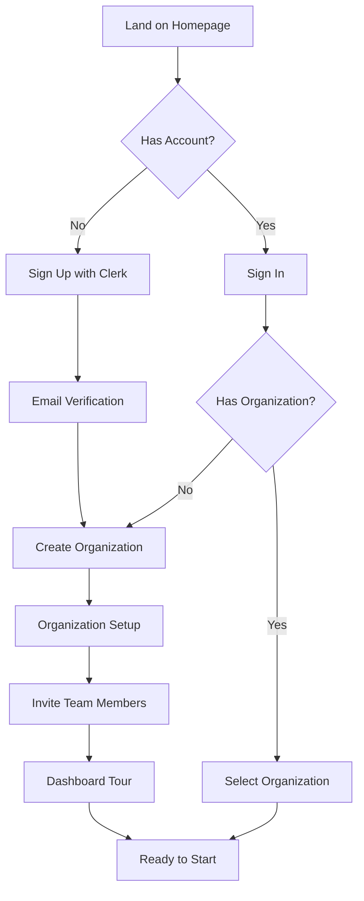

### Key Screens:
1. **Sign Up**: Email, password, agency name
2. **Organization Setup**: Company details, timezone, branding
3. **Team Invites**: Optional bulk invite via email
4. **Dashboard Tour**: Interactive tooltips for first-time users

## 2. Core Audit Creation Flow

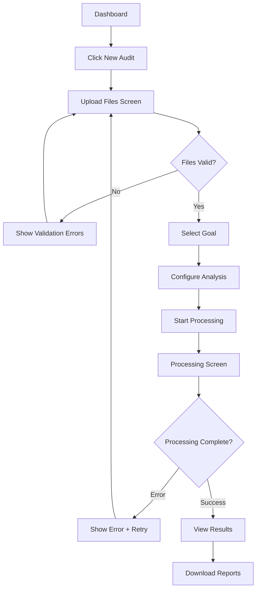

### Detailed Steps:

#### 2.1 File Upload Process
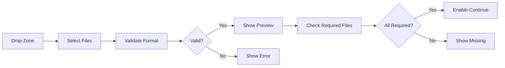

#### 2.2 Goal Selection
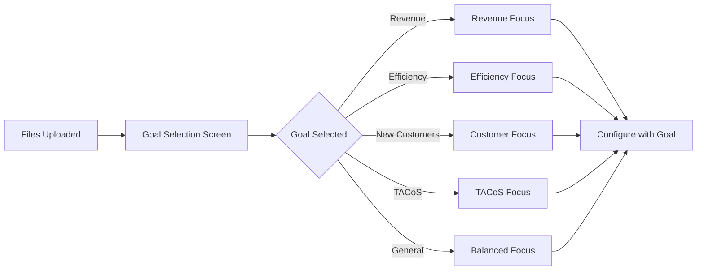

#### 2.3 Processing States
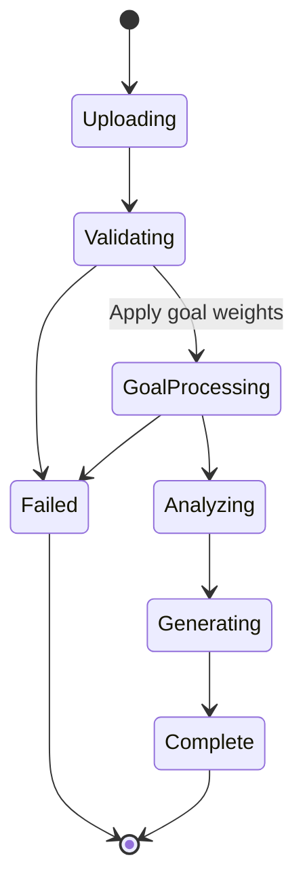

## 3. Results Exploration Flow

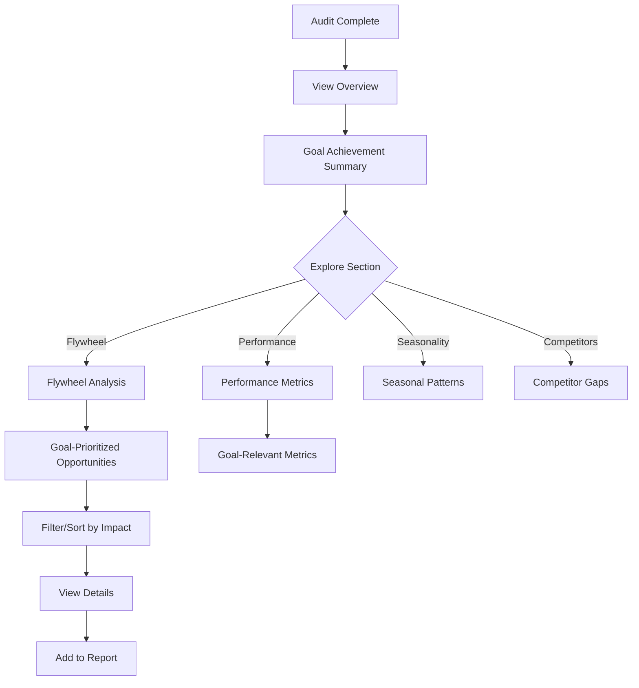

## 4. Report Generation Flow

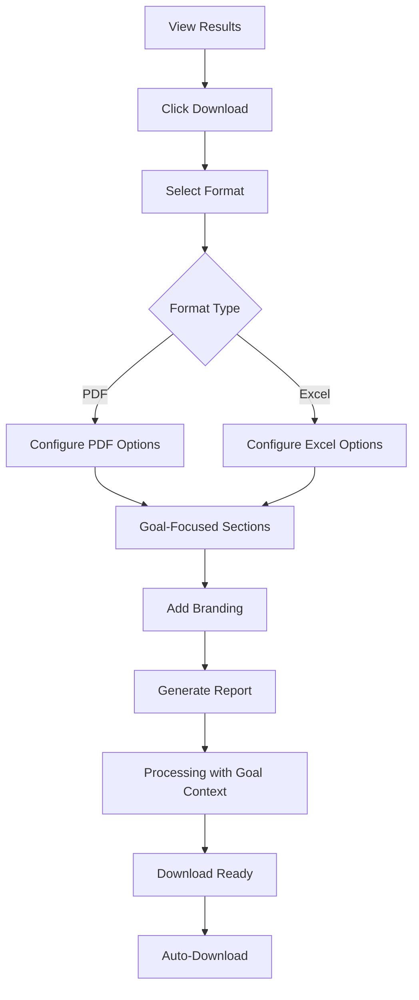

### Report Options:
- **PDF**: Goal-specific executive summary, prioritized insights, relevant charts
- **Excel**: Goal-weighted recommendations, implementation tracker, ROI projections

## 5. Multi-Client Management Flow

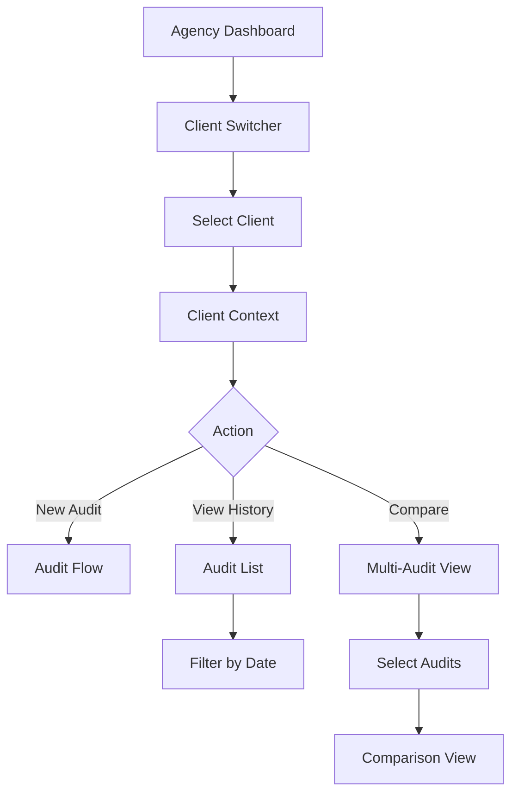

## 6. Flywheel Opportunity Flow (Unique Feature)

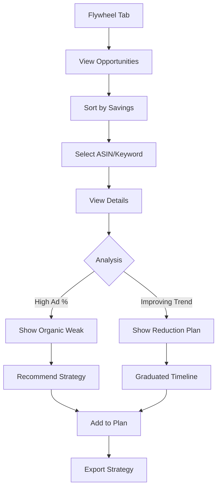

### Flywheel Decision Tree:
```
IF goal = TACoS_OPTIMIZATION
  THEN weight_flywheel_opportunities = 1.8x
  
IF ad_attribution% > 80% AND trend = improving
  THEN "High opportunity - reduce bids gradually"
  IF goal = EFFICIENCY 
    THEN priority = HIGH
  IF goal = REVENUE
    THEN priority = MEDIUM
    
ELSE IF ad_attribution% > 80% AND trend = stable
  THEN "Monitor - may need organic boost first"
  
ELSE IF ad_attribution% < 40% AND sales = high
  THEN "Strong organic - minimize ad spend"
  IF goal = EFFICIENCY
    THEN priority = CRITICAL
```

## 7. Error Recovery Flows

### 7.1 Upload Failure
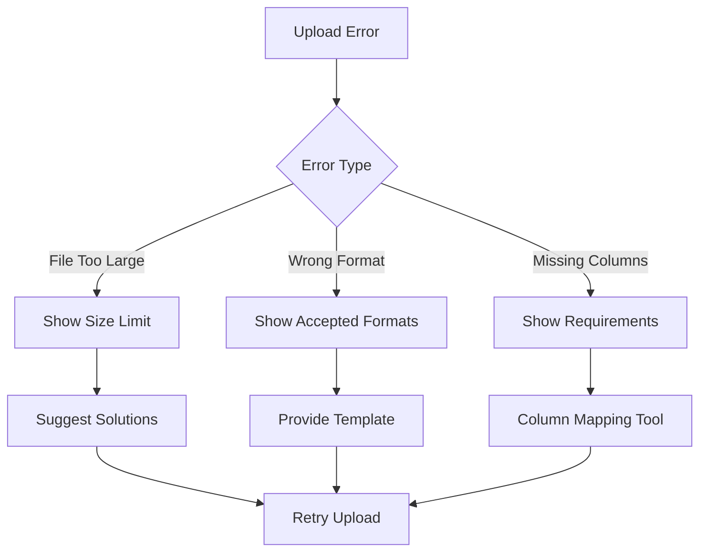

### 7.2 Processing Failure
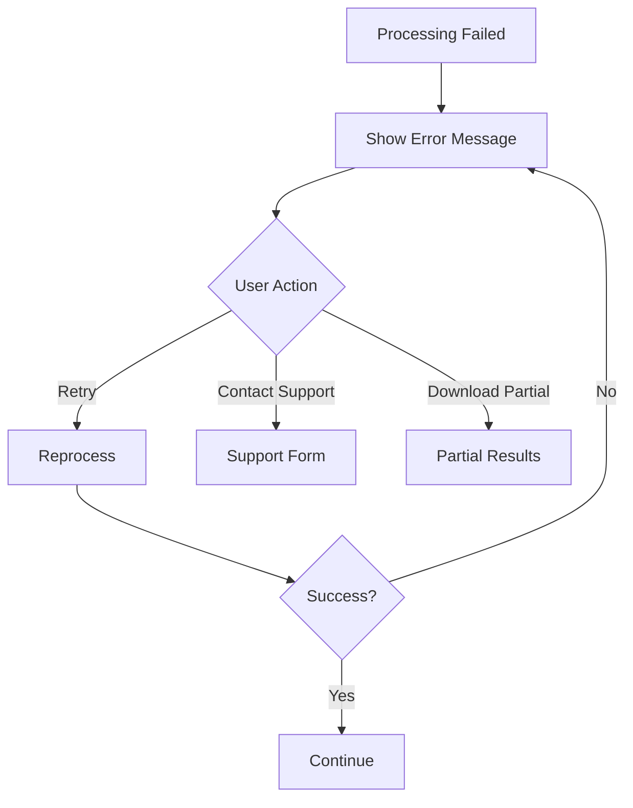

## 8. Empty States & First-Time Experiences

### 8.1 No Audits Yet
- Illustration of audit process
- "Start Your First Audit" CTA
- Sample report preview link
- Video tutorial option

### 8.2 No Flywheel Opportunities
- Educational content about flywheel concept
- Tips for improving organic performance
- Link to knowledge base

### 8.3 Processing First Audit
- Extended tooltips explaining each step
- Goal selection helper: "Not sure? Start with General Health Check"
- Real-time status updates
- Estimated completion time
- "What to expect" sidebar with goal-specific insights

## 9. Mobile Experience Flow

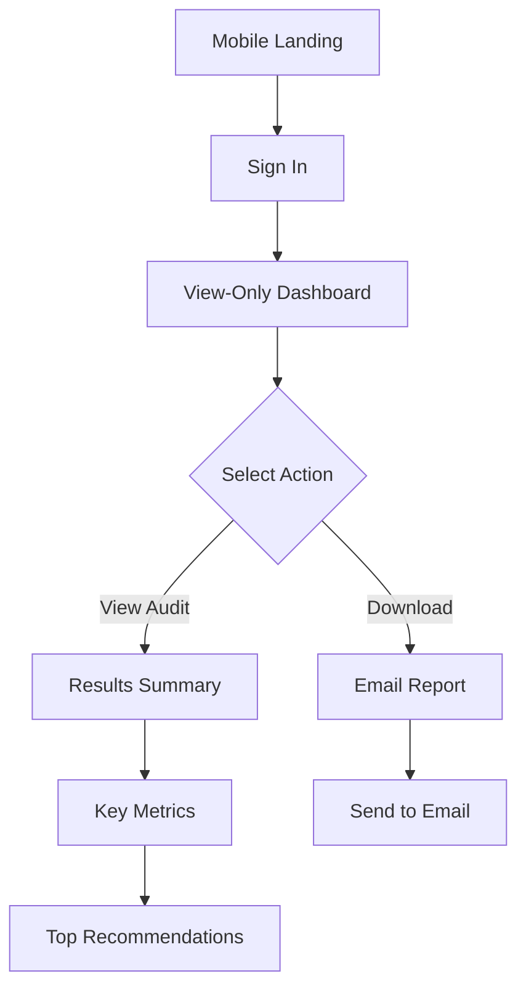

### Mobile Limitations:
- No file upload capability
- Simplified charts and tables
- Focus on key insights only
- Email report delivery

## 10. User Preference Management

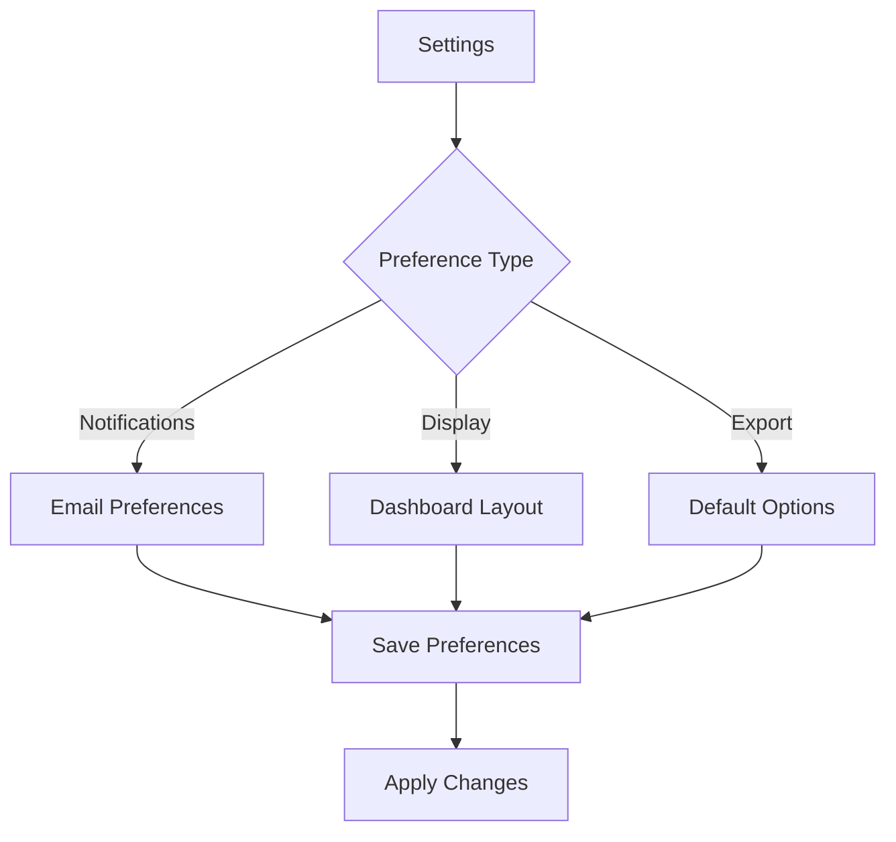

---

## Key Interaction Principles

1. **Progressive Disclosure**: Don't overwhelm with all options at once
2. **Clear Feedback**: Every action has immediate visual response
3. **Graceful Degradation**: Errors don't break the flow
4. **Contextual Help**: Tooltips and hints where needed
5. **Consistent Patterns**: Similar actions work the same way everywhere

## Success Metrics for Flows

- **Onboarding**: 80% complete first audit within 10 minutes
- **Goal Selection**: 85% select specific goal (not general)
- **Upload Success**: 95% successful on first attempt
- **Report Generation**: <30 seconds for any format
- **Goal Achievement**: 70% report improved metrics for selected goal
- **Error Recovery**: 90% self-service resolution
- **Mobile Engagement**: 60% check results on mobile